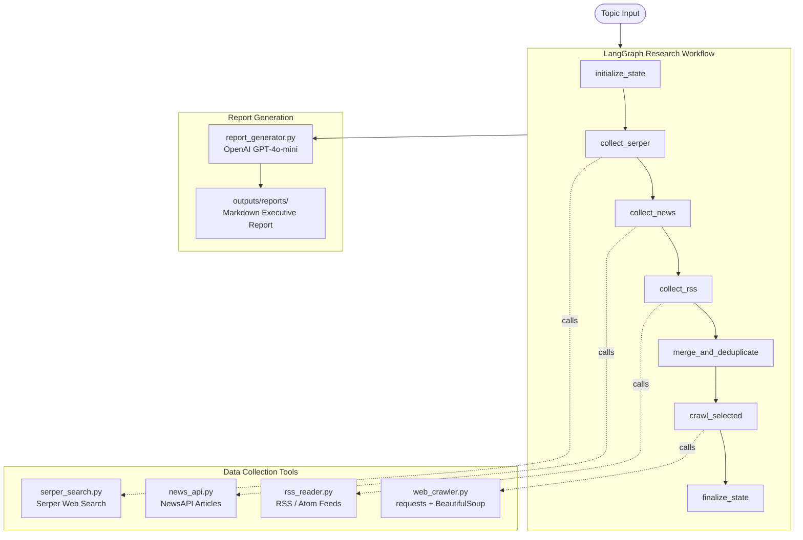

# HYMIND

**Autonomous Hydrogen Engineering Intelligence Agent**

HYMIND collects external market, technology, and policy signals from multiple sources, analyzes them using OpenAI, and produces structured executive intelligence reports for the hydrogen and fuel cell industry.

---

## Current Status

**Phase 1 MVP Completed**

All Phase 1 capabilities are implemented, tested, and operational:

| Capability | Status |
|---|---|
| Serper web search integration | Done |
| NewsAPI article retrieval | Done |
| RSS feed ingestion | Done |
| Web content crawler | Done |
| LangGraph research workflow | Done |
| OpenAI report synthesis | Done |
| Markdown report generation | Done |
| Automated test suite (72 tests) | Done |

**Phase 2 — Planned Future Enhancements**

PDF export, email/Telegram delivery, scheduled automation, RAG/vector memory, parallelized collection, and n8n workflow integration are planned for Phase 2 and are not included in this release.

---

## Architecture Overview



---

## Workflow Steps

| Step | Node | What it does |
|---|---|---|
| 1 | `initialize_state` | Sets run metadata and start timestamp |
| 2 | `collect_serper` | Queries Serper for organic and news search results |
| 3 | `collect_news` | Queries NewsAPI for recent articles |
| 4 | `collect_rss` | Fetches entries from configured hydrogen RSS feeds |
| 5 | `merge_and_deduplicate` | Combines all sources, deduplicates by normalised URL |
| 6 | `crawl_selected` | Crawls top 5 non-PDF URLs for full article content |
| 7 | `finalize_state` | Computes counts, duration, and error summary |
| 8 | `generate_report` | Builds context, calls OpenAI, saves Markdown report |

All collection nodes (steps 2–4) fail gracefully: a missing API key or network error appends to the `errors` or `warnings` list and the pipeline continues with partial results.

---

## Normalized Result Schema

All collection tools produce results with the same field set, enabling lossless merging:

| Field | Type | Description |
|---|---|---|
| `title` | `str` | Article or result title |
| `url` | `str` | Source URL |
| `snippet` | `str` | Summary, description, or teaser text |
| `published_at` | `str \| None` | Publication date (raw string from source) |
| `source` | `str` | Publisher name |
| `source_type` | `str` | `organic`, `news`, or `rss` |
| `search_query` | `str` | The query or feed URL that produced this result |
| `author` | `str \| None` | Author name if available |
| `rank` | `int` | Position within its source |

The crawler uses a separate schema (`content`, `content_length`, `extraction_success`) since it produces full page text rather than search snippets.

---

## Tool Stack

| Layer | Tool | Purpose |
|---|---|---|
| Language | Python 3.11+ | Core implementation |
| Agent framework | LangGraph 1.x | State machine workflow orchestration |
| LLM | OpenAI GPT-4o-mini | Research synthesis and report generation |
| Web search | Serper API | Google search results |
| News | NewsAPI | News article retrieval |
| RSS | feedparser + requests | Hydrogen industry feed ingestion |
| Web crawling | requests + BeautifulSoup + lxml | Article content extraction |
| Retry logic | tenacity | Exponential back-off on transient failures |
| Logging | Python logging + Rich | Structured console and file logging |
| Env config | python-dotenv | Secret and config management |

---

## Reliability Features

- **Graceful failure per source**: each collection node catches all exceptions and appends to `errors`/`warnings` — one failing source never blocks others
- **API key pre-checking**: missing keys in workflow nodes become warnings, not `sys.exit` — the pipeline completes with partial results
- **Tenacity retry**: all external HTTP calls retry on `Timeout`, `ConnectionError`, HTTP 429, and HTTP 5xx with exponential back-off
- **URL deduplication**: merged results are deduplicated by normalised URL (lowercase, trailing-slash stripped) before crawling
- **PDF pre-filtering**: PDF URLs are excluded from the crawl queue automatically
- **Boilerplate removal**: web crawler strips `script`, `style`, `nav`, `footer`, `header`, `aside`, `form`, and `iframe` before text extraction
- **JS-rendered site detection**: crawler returns `extraction_success=False` for shell HTML pages and continues
- **Structured logging**: every tool and workflow node logs `start`, `complete`, `result count`, and `error` events to both console (Rich) and `logs/hymind.log` (DEBUG level)
- **No secrets in logs**: API keys sent via headers, not URL query params; keys are never logged

---

## Report Structure

Each generated report (`outputs/reports/YYYYMMDD_HHMMSS_hymind_report.md`) contains:

1. **Research Topic** — scope statement
2. **Executive Summary** — 150–250 word strategic brief
3. **Key Developments** — source-backed bullet points
4. **Market Implications** — trend and demand analysis
5. **Technology Signals** — engineering and deployment signals
6. **Policy and Funding Signals** — government programs and regulations
7. **Competitive Notes** — company activity visible in research
8. **Risks and Watchouts** — identified uncertainties and gaps
9. **Source Traceability** — all contributing URLs with type labels
10. **Workflow Metadata** — pipeline statistics table (programmatically generated)

---

## Setup

### Prerequisites

- Python 3.11+
- Conda environment (or virtualenv)
- API keys for: OpenAI, Serper, NewsAPI

### Installation

```powershell
# Clone and enter the project
cd HYMIND

# Install the package (use the conda hymind env, or your own)
C:\Users\nest\.conda\envs\hymind\python.exe -m pip install -e .

# Configure environment
Copy-Item .env.example .env
# Edit .env and fill in your API keys
```

### Configuration (`.env`)

```env
OPENAI_API_KEY=sk-...
OPENAI_MODEL=gpt-4o-mini

SERPER_API_KEY=...
SERPER_SEARCH_URL=https://google.serper.dev/search

NEWS_API_KEY=...
NEWS_API_BASE_URL=https://newsapi.org/v2

LOG_LEVEL=INFO
MAX_SEARCH_RESULTS=10
MAX_ARTICLES_PER_RUN=10
```

### Run the full pipeline

```powershell
# Default topic
C:\Users\nest\.conda\envs\hymind\python.exe -m hymind.main

# Custom topic
C:\Users\nest\.conda\envs\hymind\python.exe -m hymind.main "hydrogen funding Germany 2026"
```

Output: a Markdown report in `outputs/reports/`.

---

## Repository Layout

```text
HYMIND/
├── src/hymind/
│   ├── tools/
│   │   ├── openai_client.py      # OpenAI wrapper with retry
│   │   ├── serper_search.py      # Serper web search
│   │   ├── news_api.py           # NewsAPI article retrieval
│   │   ├── rss_reader.py         # RSS/Atom feed ingestion
│   │   └── web_crawler.py        # Article content extraction
│   ├── workflows/
│   │   ├── state.py              # AgentState TypedDict
│   │   └── research_workflow.py  # LangGraph 7-node pipeline
│   ├── reporting/
│   │   └── report_generator.py   # OpenAI report synthesis
│   └── utils/
│       └── logger.py             # Shared structured logger
├── docs/
│   ├── architecture/
│   ├── roadmap/
│   ├── operations/
│   ├── project_state.md
│   └── decision_log.md
├── skills/
│   ├── governance/               # Engineering behavior rules
│   └── operational/              # Domain execution rules
├── memory/active/                # Session operational memory
├── samples/reports/              # Curated sample reports (tracked in git)
├── outputs/reports/              # Generated runtime reports (gitignored)
├── logs/                         # Runtime log files (gitignored)
├── tests/                        # Automated test suite (72 tests)
├── .env.example                  # Configuration template
├── requirements.txt
└── pyproject.toml
```

---

## Development Notes

- Do not commit `.env` or any file containing real API keys
- Generated reports land in `outputs/reports/` — excluded from git
- Log files land in `logs/` — excluded from git
- Sample reports are kept in `samples/reports/` — tracked in git for reference
- Keep changes small and focused; the workflow is the integration point
- Phase 1 MVP is complete; Phase 2 adds PDF export, notifications, and scheduling
