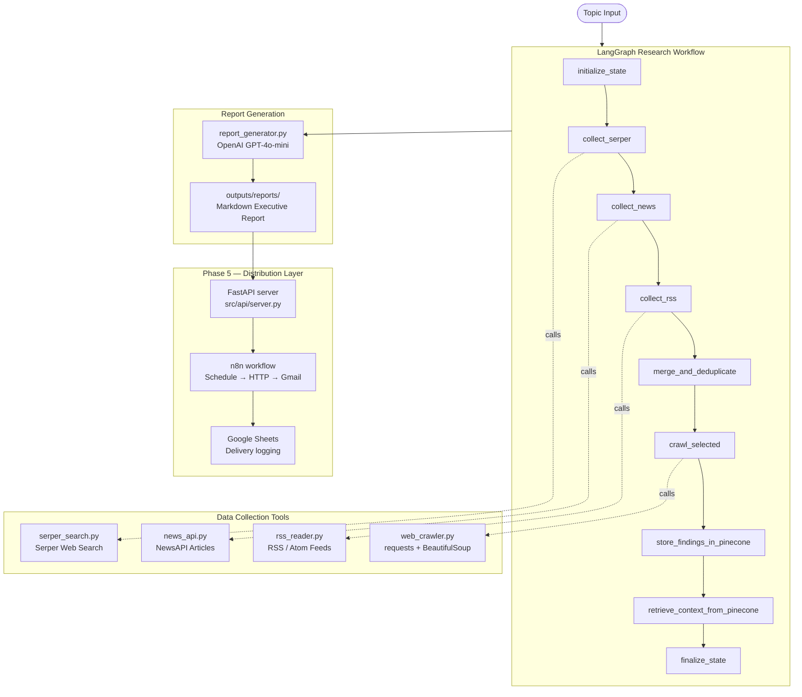

# HYMIND

**Hydrogen Market Intelligence & Data**

HYMIND collects external market, technology, policy, and competitor signals from multiple sources, analyzes them using OpenAI, and produces structured executive intelligence reports for the hydrogen and fuel cell industry. A FastAPI HTTP wrapper and n8n workflow automate weekly scheduled delivery via Gmail.

---

## Current Status — Phase 1–7 Complete

| Capability | Phase | Status |
|---|---|---|
| Serper web search integration | 1 | Done |
| NewsAPI article retrieval | 1 | Done |
| RSS feed ingestion | 1 | Done |
| Web content crawler | 1 | Done |
| LangGraph research workflow | 1 | Done |
| OpenAI report synthesis | 1 | Done |
| Markdown report generation | 1 | Done |
| Collector abstraction + validation layer | 2 | Done |
| Pinecone RAG storage and retrieval | 3 | Done |
| Output validation layer + reliability hardening | 4 | Done |
| 243-test automated suite | 1–4 | Done |
| FastAPI HTTP wrapper | 5 | Done |
| n8n scheduled workflow + Gmail delivery | 5 | Done |
| Google Sheets delivery logging | 5 | Done |
| README finalization + architecture documentation | 6 | Done |
| Centralized search query config (`src/config/research_topics.py`) | 7 | Done |
| Pillar-organized Serper queries (15) + NewsAPI queries (9) | 7 | Done |
| Crawl blocklist (18 low-value market research domains) | 7 | Done |
| Upgraded report prompts (European H2 + fuel cell focus) | 7 | Done |

---

## Architecture Overview



The core LangGraph pipeline ends at Markdown report generation. The Phase 5 distribution layer runs on top of that output via n8n.

---

## Workflow Steps

| Step | Node | What it does |
|---|---|---|
| 1 | `initialize_state` | Sets run metadata and start timestamp |
| 2 | `collect_serper` | Queries Serper for organic and news search results |
| 3 | `collect_news` | Queries NewsAPI for recent articles |
| 4 | `collect_rss` | Fetches entries from configured hydrogen RSS feeds |
| 5 | `merge_and_deduplicate` | Combines all sources, deduplicates by normalised URL |
| 6 | `crawl_selected` | Crawls up to 20 non-PDF, non-blocklisted URLs for full article content |
| 7 | `store_findings_in_pinecone` | Embeds merged findings and upserts to Pinecone (skipped if not configured) |
| 8 | `retrieve_context_from_pinecone` | Retrieves top-5 semantically similar historical findings (skipped if not configured) |
| 9 | `finalize_state` | Computes counts, duration, and error summary |
| 10 | `generate_report` | Builds context (including RAG history), calls OpenAI, saves Markdown report |

All collection nodes (steps 2–4) fail gracefully: a missing API key or network error appends to the `errors` or `warnings` list and the pipeline continues with partial results.

---

## Normalized Result Schema

All collection tools produce results with the same field set, enabling lossless merging:

| Field | Type | Description |
|---|---|---|
| `title` | `str` | Article or result title |
| `url` | `str` | Source URL |
| `snippet` | `str` | Summary, description, or teaser text |
| `published_at` | `str \| None` | Publication date (raw string from source) |
| `source` | `str` | Publisher name |
| `source_type` | `str` | `organic`, `news`, or `rss` |
| `search_query` | `str` | The query or feed URL that produced this result |
| `author` | `str \| None` | Author name if available |
| `rank` | `int` | Position within its source |

The crawler uses a separate schema (`content`, `content_length`, `extraction_success`) since it produces full page text rather than search snippets.

---

## RAG Layer (Phase 3)

HYMIND includes a Pinecone-backed retrieval layer that gives the report generator access to historical findings from previous runs.

### Why Pinecone

Each research run collects 10–30 normalized findings. Without persistent memory, the system starts cold every time and cannot track trends or compare current intelligence against past signals. Pinecone provides managed vector search with metadata filtering, enabling semantic retrieval across all previous runs.

### What is stored

Each merged finding is embedded (title + snippet via `text-embedding-3-small`) and stored with metadata:

| Field | Description |
|---|---|
| `title`, `url`, `source`, `source_type` | Source identity |
| `published_at` | Original publication date |
| `snippet` | Search/article summary |
| `content_preview` | First 500 chars of crawled content (if available) |
| `topic` | Research topic used for this run |
| `collected_at` | ISO timestamp when stored |

### Retrieval behavior

After each run's findings are stored, the pipeline queries Pinecone for the top 5 semantically closest historical findings using the current topic as the query. Retrieved context is injected into the report's research context under a `=== HISTORICAL CONTEXT ===` header, giving the LLM signal for trend comparison and pattern recognition.

### Graceful degradation

If `PINECONE_API_KEY` or `OPENAI_API_KEY` is absent, both RAG nodes emit a warning and the pipeline continues without error. Reports are still generated — they just have no historical context section.

### Cost and rate limits

- Embeddings: `text-embedding-3-small` costs ~$0.02/1M tokens. A typical run with 20 findings embeds ~5,000 tokens — negligible cost.
- Pinecone: Free serverless tier includes 1 index with 100K vectors, sufficient for months of daily runs.
- No retries in the RAG layer beyond the OpenAI client defaults. Transient failures emit a warning rather than crashing.

---

## Reliability Features (Phase 4)

- **Graceful failure per source**: each collection node catches all exceptions and appends to `errors`/`warnings` — one failing source never blocks others
- **API key pre-checking**: missing keys in workflow nodes become warnings, not `sys.exit` — the pipeline completes with partial results
- **Tenacity retry**: all external HTTP calls retry on `Timeout`, `ConnectionError`, HTTP 429, and HTTP 5xx with exponential back-off
- **Output validation layer**: `validate_findings()` removes URL-absent and duplicate entries before report synthesis; `check_state_quality()` assesses state completeness
- **URL deduplication**: merged results are deduplicated by normalised URL (lowercase, trailing-slash stripped) before crawling
- **PDF pre-filtering**: PDF URLs are excluded from the crawl queue automatically
- **Boilerplate removal**: web crawler strips `script`, `style`, `nav`, `footer`, `header`, `aside`, `form`, and `iframe` before text extraction
- **JS-rendered site detection**: crawler returns `extraction_success=False` for shell HTML pages and continues
- **Node-level logging**: every workflow node emits `=== Node START ===` and `=== Node END ===` markers plus counts and error events to both console (Rich) and `logs/hymind.log` (DEBUG level)
- **No secrets in logs**: API keys sent via headers, not URL query params; keys are never logged
- **243 automated tests**: covers all collectors, workflow nodes, RAG layer, output validator, and failure scenarios (timeouts, malformed feeds, node isolation, degraded pipeline)

---

## Report Structure

Each generated report (`outputs/reports/YYYYMMDD_HHMMSS_hymind_report.md`) contains:

1. **Research Topic** — scope statement
2. **Executive Summary** — 150–250 word strategic brief
3. **Key Developments** — source-backed bullet points
4. **Market Implications** — trend and demand analysis
5. **Technology Signals** — engineering and deployment signals
6. **Policy and Funding Signals** — government programs and regulations
7. **Competitive Notes** — company activity visible in research
8. **Risks and Watchouts** — identified uncertainties and gaps
9. **Source Traceability** — all contributing URLs with type labels
10. **Workflow Metadata** — pipeline statistics table (programmatically generated)

Sample reports are available in `outputs/sample_reports/`.

---

## Tool Stack

| Layer | Tool | Purpose |
|---|---|---|
| Language | Python 3.11+ | Core implementation |
| Agent framework | LangGraph 1.x | State machine workflow orchestration |
| LLM | OpenAI GPT-5.1 | Research synthesis and report generation |
| Web search | Serper API | Google search results |
| News | NewsAPI | News article retrieval |
| RSS | feedparser + requests | Hydrogen industry feed ingestion |
| Web crawling | requests + BeautifulSoup + lxml | Article content extraction |
| Retry logic | tenacity | Exponential back-off on transient failures |
| Logging | Python logging + Rich | Structured console and file logging |
| Env config | python-dotenv | Secret and config management |
| HTTP API | FastAPI + uvicorn | HTTP wrapper for n8n integration |
| Distribution | n8n | Scheduled trigger, Gmail delivery, Google Sheets logging |

---

## Setup

### Prerequisites

- Python 3.11+
- Conda environment (or virtualenv)
- API keys for: OpenAI, Serper, NewsAPI

### Installation

```powershell
# Clone and enter the project
cd HYMIND

# Install the package (use the conda hymind env, or your own)
C:\Users\nest\.conda\envs\hymind\python.exe -m pip install -e .

# Configure environment
Copy-Item .env.example .env
# Edit .env and fill in your API keys
```

### Configuration (`.env`)

```env
OPENAI_API_KEY=sk-...
OPENAI_MODEL=gpt-5.1
OPENAI_EMBEDDING_MODEL=text-embedding-3-small

SERPER_API_KEY=...
SERPER_SEARCH_URL=https://google.serper.dev/search

NEWS_API_KEY=...
NEWS_API_BASE_URL=https://newsapi.org/v2

# Optional — Pinecone RAG layer (Phase 3)
PINECONE_API_KEY=
PINECONE_INDEX_NAME=hymind-research
PINECONE_CLOUD=aws
PINECONE_REGION=us-east-1

# Output directories
REPORT_OUTPUT_DIR=outputs
REPORT_ARCHIVE_DIR=reports

# Optional — API server authentication (Phase 5)
HYMIND_API_KEY=

LOG_LEVEL=INFO
MAX_SEARCH_RESULTS=15
MAX_ARTICLES_PER_RUN=15
```

### Pinecone Setup (optional — Phase 3 RAG)

If you want historical context in reports, configure a Pinecone index before running:

1. Create a free account at [app.pinecone.io](https://app.pinecone.io)
2. Create a Serverless index with these settings:
   - **Name**: `hymind-research` (or set `PINECONE_INDEX_NAME`)
   - **Dimensions**: `1536`
   - **Metric**: `cosine`
   - **Cloud / Region**: `aws / us-east-1` (or adjust env vars)
3. Copy your API key to `PINECONE_API_KEY` in `.env`
4. Run the pipeline normally — findings are stored automatically on each run

Without Pinecone configured, the pipeline skips RAG storage and retrieval silently.

### Run the full pipeline

```powershell
# Default topic
python -m main

# Custom topic
python -m main "hydrogen funding Germany 2026"
```

Output: a Markdown report in `outputs/reports/`.

### Run the tests

```powershell
# Full test suite (243 tests, no live API calls)
pytest tests/ -v

# Phase 4 reliability and validator tests only
pytest tests/test_reliability.py tests/test_validator.py -v
```

---

## Phase 5 — API Server and n8n Integration

HYMIND exposes a FastAPI HTTP wrapper so n8n (or any HTTP client) can trigger a research run and receive the Markdown report content in the response. An n8n workflow then converts the Markdown to HTML and delivers it via Gmail, with delivery status logged to Google Sheets.

**Note:** PDF generation was evaluated and descoped from the MVP. The n8n workflow uses its built-in Markdown node to convert the report to HTML inline before sending via Gmail. This avoids an additional dependency and produces an email-readable format without a separate conversion step.

### Start the API server locally

```powershell
# Install API dependencies (one-time, if not already installed)
C:\Users\nest\.conda\envs\hymind\python.exe -m pip install fastapi "uvicorn[standard]"

# Start the server
uvicorn src.api.server:app --host 0.0.0.0 --port 8000 --reload

# Alternative: use the convenience script
python scripts/run_api.py

# Alternative: start server + ngrok in one step
python start_hymind_api.py
```

The server starts at `http://localhost:8000`. The interactive docs are at `http://localhost:8000/docs`.

### Test the endpoint locally

```powershell
curl -X POST "http://localhost:8000/run-hymind" `
  -H "Content-Type: application/json" `
  -d "{\"topic\":\"weekly hydrogen and fuel cell market intelligence\",\"report_type\":\"weekly_executive\",\"run_mode\":\"manual\"}"
```

Liveness check:

```powershell
curl http://localhost:8000/health
```

### Expose to n8n via ngrok

n8n cannot reach `localhost` directly. Use ngrok to create a public tunnel:

```powershell
# Install ngrok from https://ngrok.com/download, then:
ngrok http 8000

# Or with a fixed domain (if you have one configured):
ngrok http --domain=YOUR-DOMAIN.ngrok-free.app 8000
```

ngrok prints a public URL like `https://abc123.ngrok-free.app`. Use that URL in the n8n HTTP Request node.

### n8n workflow

The exported n8n workflow is in `n8n/HYMIND.json`. Import it into your n8n instance. The workflow:

1. **Schedule Trigger** — fires every Monday at 08:00
2. **HTTP Request** — `POST /run-hymind` to the ngrok URL (update this URL to your own ngrok domain)
3. **IF** — checks `$json.status == success`
4. **Markdown → HTML** — converts the Markdown report content to HTML
5. **Gmail: Send report** — sends the HTML report to the configured recipient
6. **Google Sheets: Log delivery** — appends timestamp, report title, and delivery status to a tracking sheet
7. **Gmail: Send error alert** — fires on the failure branch

See `docs/operations/n8n_workflow.md` for full configuration instructions.

### API response

Success:

```json
{
  "status": "success",
  "report_title": "HYMIND Executive Intelligence Report",
  "report_content": "# Markdown report content...",
  "report_path": "outputs/reports/20260519_080500_hymind_report.md",
  "generated_at": "2026-05-19T08:05:00+00:00"
}
```

Failure:

```json
{
  "status": "failed",
  "error": "OPENAI_API_KEY is not set — report generation requires OpenAI.",
  "generated_at": "2026-05-19T08:05:00+00:00"
}
```

### Optional API key authentication

Set `HYMIND_API_KEY` in `.env` to protect the endpoint:

```env
HYMIND_API_KEY=your-secret-key
```

When set, every request must include the header:

```
x-api-key: your-secret-key
```

In n8n: add a Header Auth credential with the key `x-api-key` and your value. The exported workflow already references a Header Auth credential — recreate it with your key.

Leave `HYMIND_API_KEY` empty for unauthenticated local development.

---

## Repository Layout

```text
HYMIND/
├── src/
│   ├── api/
│   │   └── server.py             # FastAPI wrapper (Phase 5)
│   ├── config/
│   │   └── research_topics.py    # Serper queries, NewsAPI queries, RSS feeds (Phase 7)
│   ├── tools/
│   │   ├── openai_client.py      # OpenAI wrapper with retry
│   │   ├── serper_search.py      # Serper web search
│   │   ├── news_api.py           # NewsAPI article retrieval
│   │   ├── rss_reader.py         # RSS/Atom feed ingestion
│   │   ├── web_crawler.py        # Article content extraction
│   │   └── collector.py          # CollectorProtocol + validation layer
│   ├── rag/
│   │   ├── schemas.py            # StoredFinding / RetrievedFinding dataclasses
│   │   ├── embeddings.py         # OpenAI embeddings client
│   │   ├── pinecone_store.py     # Pinecone upsert and query
│   │   └── retriever.py          # High-level store_from_state / retrieve_context
│   ├── workflows/
│   │   ├── state.py              # AgentState TypedDict
│   │   └── research_workflow.py  # LangGraph 9-node pipeline
│   ├── reporting/
│   │   ├── report_generator.py   # OpenAI report synthesis (includes RAG context)
│   │   └── validator.py          # Output validation layer (Phase 4)
│   ├── utils/
│   │   └── logger.py             # Shared structured logger
│   └── main.py                   # CLI entry point
├── n8n/
│   ├── HYMIND.json               # Main n8n workflow (Schedule → HTTP → Gmail)
│   └── Global Error Handler.json # n8n error handler workflow
├── docs/
│   ├── architecture/             # System and API architecture docs
│   ├── roadmap/                  # Phase roadmap and sprint plan
│   ├── operations/               # Task board, limitations, workflow docs, demo runbook
│   ├── planning/
│   │   └── stories.md            # User stories and Agile artifacts
│   ├── project_state.md          # Current phase status
│   └── decision_log.md           # Architecture decision record
├── skills/
│   ├── governance/               # Engineering behavior rules
│   └── operational/              # Domain execution rules
├── memory/active/                # Session operational memory
├── outputs/
│   ├── reports/                  # Generated Markdown reports (gitignored, kept by pattern)
│   └── sample_reports/           # 3 example reports included in repo
├── tests/                        # 243-test automated suite
├── scripts/
│   └── run_api.py                # uvicorn convenience start script
├── start_hymind_api.py           # One-shot: starts FastAPI + ngrok + prints n8n config
├── AGENTS.md                     # Agent runtime instructions
├── CLAUDE.md                     # Claude Code session instructions
├── .env.example                  # Configuration template
├── requirements.txt
└── pyproject.toml
```

---

## Known Limitations

- **Single-industry scope**: HYMIND is focused on hydrogen and fuel cell intelligence only
- **No real-time streaming**: reports are batch-generated, not event-driven
- **JS-rendered sites**: crawler returns `extraction_success=False` for React/Next.js shells — crawl success rate depends on URL mix
- **Pinecone manual setup**: the `hymind-research` index must be created manually before the RAG layer activates
- **LLM dependency**: hallucination risk is mitigated by RAG grounding and source traceability but not eliminated
- **No enterprise auth**: local API key management only; no SSO or RBAC
- **ngrok URL reconfiguration**: the n8n workflow JSON contains a fixed ngrok URL; update the HTTP Request node URL after importing the workflow

Full limitations are in `docs/operations/limitations.md`.

---

## Development Notes

- Do not commit `.env` or any file containing real API keys
- Generated reports land in `outputs/reports/` — kept in git by `*.md` pattern
- Log files land in `logs/` — excluded from git
- Keep changes small and focused; the workflow is the integration point
- `python -m main` runs the full pipeline after `pip install -e .`
- `uvicorn src.api.server:app --host 0.0.0.0 --port 8000 --reload` starts the API server
